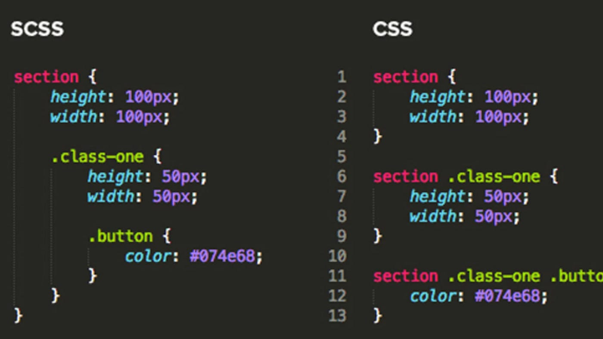
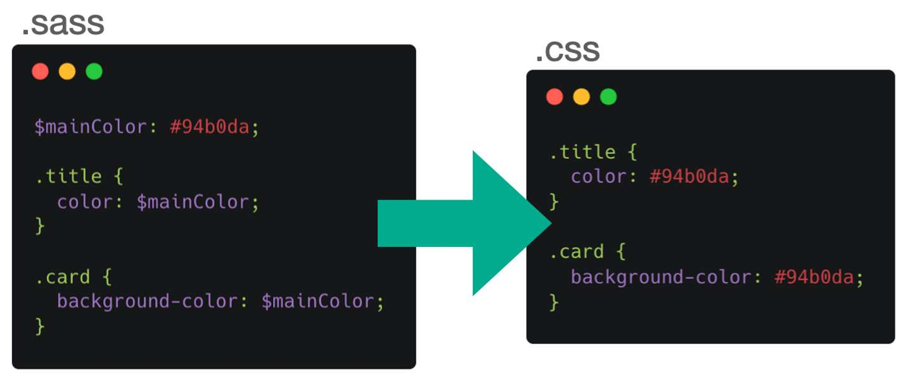

# SASS DOCUMENTATION

Thanks for visiting my GitHub account!

 **Sass** is a preprocessor scripting language that is interpreted or compiled into Cascading Style Sheets. SassScript is the scripting language itself. Sass consists of two syntaxes. The original syntax, called "the indented syntax," uses a syntax similar to Haml. [see-more](https://www.w3schools.com/sass/)

## Source Code (Download)

[Click Here](https://mega.nz/folder/RGFiUApD#PoKIVCwF8IkQhE2PHw1XxQ)

## Required Software (Download)

- VS Code, Download ->https://code.visualstudio.com/download

## Project Overview

|                              |
| :--------------------------: | :--------------------------------: |
|         CSS vs SASS          |            CSS vs SASS             |
|  |  |
| ! |

## Learning outcomes

1. Introduction to SASS
2. SASS Variables & CSS Rules nesting
3. Partials & SASS folder structure
4. @mixin and @include
5. inheriting css styles using @extend
6. @if, @else if, @else
7. @for, @while loop
8. @map over items using @each

### 1. [Introduction to SASS](https://youtu.be/fL-XB_IpWV4)

#### 1.1 What is SASS?

- Syntactically Awesome Style Sheet
- extension of CSS / CSS Preprocessor
- it allows us to use logic in CSS
- It was developed in 2006

#### 1.2 Prerequisites for learning SASS?

- HTML, CSS, Basic Javascript will help as well

#### 1.3 Why SASS?

- It helps to make our code short, simpler and more maintainable
- It has some extra features such as nested rules, mixins, inheritance for avoiding repeated codes -> No DRY (Dont Repeat YourSelf)

#### 1.4 How does SASS works?

- step 1: create a sass file, for example main.scss

- step 2: browser only understand css code so we need to convert sass file to css file (main.css). sass compiler will convert the file into css file. We can install live sass compiler in vscode for compiling sass code.

- step 3: use main.css file with HTML file.

#### 1.5 SASS Comments

- single line comment syntax :

  ```scss
  // this is a single line comment
  ```

- Multiple line comment syntax :

  ```scss
  /*
      this is a
      multiple line
      comment
      */
  ```

#### 1.6 SASS Settings

- use the following code in your vscode settings.json

  ```json
     // liveSass setup
    "liveSassCompile.settings.formats": [
      {
        "format": "compressed",
        "extensionName": ".css",
        "savePath": "/dist"
      }
    ],
    "liveSassCompile.settings.generateMap": true,
  ```

### 2. [SASS Variables & CSS Rules nesting](https://youtu.be/_W3fvJ87Xuw)

#### 2.1 SASS Variables

- SASS variable is more simpler than CSS variable.
- SASS Variable syntax :

  ```scss
  // sass variable declaration syntax
  $variableName: value; // here value can be string, numbers, colors, booleans, lists, nulls

  // sass variable declaration example
  $primary-color: #4c4c4c;

  // sass variable use
  header {
    background-color: $primary-color;
  }

  // css variable example
  :root {
    --primary-color: #4c4c4c;
  }
  header {
    background-color: var(--primary-color);
  }
  ```

- it allows us to use logic in CSS
- It was developed in 2006

#### 2.2 Nesting CSS Rules

- Example of nesting css rules

  ```scss
  // html part
  <nav>
      <ul>
        <li><a href="#">Home</a></li>
        <li><a href="#">About</a></li>
        <li><a href="#">Contact</a></li>
      </ul>
    </nav>
  
  
  
  // without SASS designing the nav
  nav {
    background-color: #01579b;
    height: 5rem;
  }
  nav ul {
    height: 100%;
    display: flex;
    justify-content: center;
    align-items: center;
    gap: 1rem;
  }
  nav ul li {
    padding: 0.8rem;
    border-radius: 0.6rem;
    transition: all 0.3s ease-in;
  }
  nav ul li:hover {
    background-color: #000;
  }
  nav ul li a {
    color: #fff;
  }

  // with SASS designing the nav - nestig rules
  // nav starts here
  nav {
    background-color: #01579b;
    height: 5rem;
    ul {
      height: 100%;
      display: flex;
      justify-content: center;
      align-items: center;
      gap: 1rem;
      li {
        padding: 0.8rem;
        border-radius: 0.6rem;
        transition: all 0.3s ease-in;
        a {
          color: #fff;
        }
        // list:hover can be written as &:hover here as we are targeting parent element
        &:hover {
          background-color: #000;
        }
      }
    }
  }
  // nav ends here
  ```

- Following simple navbar project showing the use of SASS variables and nesting rules

  - firts create an html file -> index.html

    ```html
    <!-- index.html -->
    <!DOCTYPE html>
    <html lang="en">
      <head>
        <meta charset="UTF-8" />
        <meta http-equiv="X-UA-Compatible" content="IE=edge" />
        <meta name="viewport" content="width=device-width, initial-scale=1.0" />
        <title>Document</title>
        <link rel="stylesheet" href="./dist/main.css" />
      </head>
      <body>
        <div class="container">
          <nav>
            <a href="#" class="nav__logo">
              <h2>Study With Anis</h2>
            </a>
            <ul class="nav__menu">
              <li class="nav__item"><a class="nav__link" href="#">Home</a></li>
              <li class="nav__item">
                <a class="nav__link" href="#">Courses</a>
              </li>
              <li class="nav__item"><a class="nav__link" href="#">About</a></li>
              <li class="nav__item">
                <a class="nav__link" href="#">Contact</a>
              </li>
            </ul>
          </nav>
        </div>
      </body>
    </html>
    ```

  - create main.scss file as the following example

    ```scss
    // variable declaraion
    $color-primary-dark: #1565c0;
    $color-text1: #fff;
    $color-text2: #000;

    $border-radius: 0.6rem;
    $tranisition: all 0.4s ease-in-out;

    // reset code
    * {
      border: none;
      box-sizing: border-box;
      margin: 0;
      padding: 0;
      list-style-type: none;
      text-decoration: none;
      outline: none;
    }
    html {
      scroll-behavior: smooth;
    }

    .container {
      max-width: 70rem;
      margin: 0 auto;
    }

    // example of nesting css rules
    // nav starts here
    nav {
      background-color: $color-primary-dark;
      display: flex;
      justify-content: space-between;
      align-items: center;
      padding: 1rem;
      .nav__logo {
        color: $color-text1;
      }
      .nav__menu {
        display: flex;
        gap: 1rem;
        .nav__item {
          padding: 0.5rem;
          border-radius: $border-radius;
          transition: $tranisition;
          .nav__link {
            color: $color-text1;
          }
          &:hover {
            background: #000;
          }
        }
      }
    }
    // nav ends here
    ```

### 3. [Partials & SASS folder structure](https://youtu.be/minJdR-8vjw)

- What is partials & why partials?
  - Partials is a modular (independent reusable) sass file.
  - Partials are reusable
  - different team member can work in different file at a time and avoid conflicts
- Partials example is given below

  - step 1: create a partial file start with underscore. example: \_reset.scss

    ```scss
    // reset code starts
    * {
      border: none;
      box-sizing: border-box;
      margin: 0;
      padding: 0;
      list-style-type: none;
      text-decoration: none;
      outline: none;
    }
    html {
      scroll-behavior: smooth;
    }
    ```

  - step 2: from anywhere you can use this partial by forwarding it.

    ```scss
    @forward "reset"; // no underscore is required while importing partials
    ```

- [sass folder structure for projects](https://itnext.io/structuring-your-sass-projects-c8d41fa55ed4)
  - for a small project
    - \_base.scss -> (boiler plate codes) can includes reset, variables, mixins and utility classes.
    - \_layout.scss -> layout such as container, grid systems etc.
    - \_component.scss -> reusable things like buttons, cards, navbar etc.
    - main.scss -> it should ONLY contain the imports from other files.
  - for a medium to large project follow 7-1 pattern (7 folders 1 file)
    - SASS folder
      - abstracts / utilities folder
        - \_index.scss -> forwarding all others file in this folder
        - \_variables.scss
        - \_functions.scss
        - \_mixins.scss
      - base folder
        - \_index.scss -> forwarding all others file in this folder
        - \_reset.scss
        - \_typography.scss
      - components/modules folder
        - \_index.scss -> forwarding all others file in this folder
        - \_buttons.scss
        - \_slider.scss
        - \_cards.scss
        - \_navbar.scss
      - layout folder
        - \_index.scss -> forwarding all others file in this folder
        - \_navigation.scss
        - \_grid.scss
        - \_header.scss
        - \_footer.scss
        - \_sidebar.scss
        - \_forms.scss
      - pages folder
        - \_index.scss -> forwarding all others file in this folder
        - \_home.scss
        - \_contact.scss
        - \_about.scss
        - \_courses.scss
      - themes folder
        - \_index.scss -> forwarding all others file in this folder
        - \_theme.scss
        - \_admin.scss
      - vendors folder
        - \_index.scss -> forwarding all others file in this folder
        - \_bootstrap.scss
        - \_jquery-ui.scss
    - main.scss file

### 4. [@mixin and @include](https://youtu.be/uJttGVgnlLQ)

- What is mixin?

  - a group of css declarations that can be reused. kind of function.
  - mixin examples are given below

    ```scss
    //example 1
    // creating  a simple @mixin
    @mixin para-style {
      font-size: 10px;
      text-align: justify;
    }

    // including or using the @mixin
    #about-me p {
      @include para-style;
      margin: 1rem;
    }

    //example 2
    // creating  a dynamic @mixin
    @mixin para-style($size, $style) {
      font-size: $size;
      text-align: $style;
    }

    // including or using the @mixin
    #about-me p {
      @include para-style(24px, justify);
      margin: 1rem;
    }
    ```

### 5. [inheriting css styles using @extend](https://youtu.be/YJQBhTLc1d4)

- inheritance allows us to bring css declarations from one selector to another.
- inheritance examples are given below

  ```scss
  .btn {
    border: none;
    border-radius: 0.6rem;
    padding: 1rem 2rem;
    cursor: pointer;
    font-size: 1.2rem;
    text-transform: uppercase;
  }

  // inherting the .btn styles using the @extend
  .btn-download {
    @extend .btn;
    background-color: orange;
  }
  ```

### 6. [@if, @else if, @else](https://youtu.be/XafbLsjEZkg)

- conditional control statement -> if, else if, else example is given below

  ```scss
  @mixin fontSize($value) {
    @if $value == big {
      font-size: 2rem;
    } @else if $value == medium {
      font-size: 1.5rem;
    } @else {
      font-size: 1rem;
    }
  }

  .download-btn {
    background-color: green;
    @include fontSize(medium);
    @include fontSize(big);
    @include fontSize(normal);
  }
  ```

### 7. [@for, @while loop](https://youtu.be/Qhas26n7jiY)

- loop control statement -> for, while example is given below

  ```scss
  // css 12 columns design
  // column width: 100% / 12 * numberOfColumns
  .col-1 {
    width: 8.33%;
  }
  .col-2 {
    width: 16.66%;
  }
  .col-3 {
    width: 25%;
  }
  .col-4 {
    width: 33.33%;
  }
  .col-5 {
    width: 41.66%;
  }
  .col-6 {
    width: 50%;
  }
  .col-7 {
    width: 58.33%;
  }
  .col-8 {
    width: 66.66%;
  }
  .col-9 {
    width: 75%;
  }
  .col-10 {
    width: 83.33%;
  }
  .col-11 {
    width: 91.66%;
  }
  .col-12 {
    width: 100%;
  }

  // we can write above css column rules so easily by using for loop or while loop
  @for $i from 1 through 12 {
    .col-#{$i} {
      width: 100% / 12 * $i;
    }
  }

  // while loop example
  $i: 1;
  @while $i < 13 {
    .col-#{$i} {
      width: 100% / 12 * $i;
    }
  }
  ```

### 8. [@map over items using @each](https://youtu.be/Qhas26n7jiY)

- example is given below

  ```scss
  // example without map
  .red-text {
    color: red;
  }
  .green-text {
    color: red;
  }
  .blue-text {
    color: blue;
  }

  // example1 with mapping items
  @each $colorName in red, green, blue {
    .#{$colorName}-text {
      color: $colorName;
    }
  }

  // example 2
  $colorsName: (red, green, blue);
  @each $colorName in $colorsName {
    .#{$colorName}-text {
      color: $colorName;
    }
  }
  ```

## Follow Me

 [Facebook](http://facebook.com/learnwithfair),  [Youtube](http://youtube.com/@learnwithfair),  [Instagram](http://instagram.com/learnwithfair)
